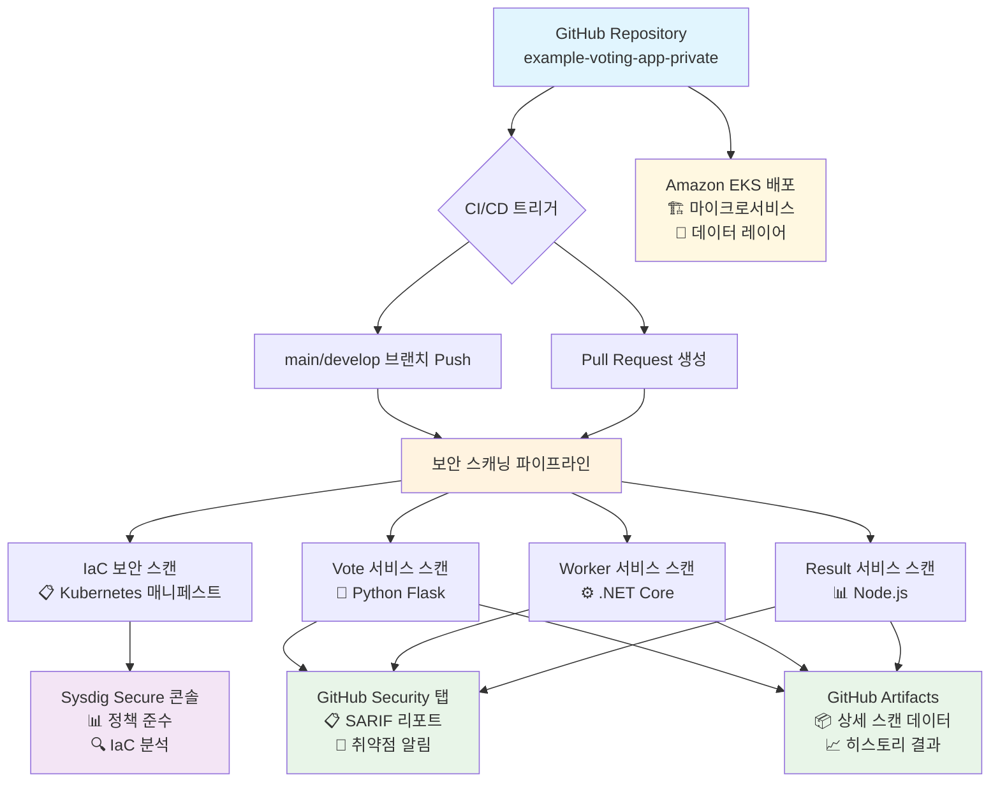

# 🗳️ Sysdig 보안 통합 투표 애플리케이션

**엔터프라이즈급 마이크로서비스 애플리케이션과 통합 DevSecOps 파이프라인**

Sysdig v6 통합으로 현대적인 클라우드 네이티브 보안 관행을 시연하는 종합적인 투표 애플리케이션으로, Amazon EKS 배포를 위해 설계되었습니다.

## 🔄 보안 파이프라인 아키텍처



## 🏗️ 애플리케이션 아키텍처

### 마이크로서비스 구성요소
- **Vote 서비스**: 투표를 위한 Python Flask 웹 인터페이스
- **Worker 서비스**: 투표 처리를 위한 .NET Core 백그라운드 프로세서
- **Result 서비스**: 실시간 결과 대시보드를 위한 Node.js
- **Redis**: 투표 큐를 위한 인메모리 데이터 저장소
- **PostgreSQL**: 투표 저장을 위한 영구 데이터베이스

### 보안 통합 스택
- **컨테이너 이미지 스캐닝**: 각 마이크로서비스의 취약점 평가
- **Infrastructure as Code (IaC) 검증**: Kubernetes 매니페스트 보안 검증
- **GitHub 보안 통합**: SARIF 기반 취약점 시각화
- **Sysdig 플랫폼**: 종합적인 보안 분석 및 정책 관리

## 🔐 DevSecOps 파이프라인

### 자동화된 보안 검사
모든 커밋과 풀 리퀘스트는 종합적인 보안 스캐닝을 트리거합니다:

| 스캔 유형 | 대상 | 결과 위치 | 목적 |
|-----------|------|-----------|------|
| **IaC 스캔** | `k8s-specifications/` | Sysdig 콘솔 | EKS 배포 보안 검증 |
| **Vote 스캔** | Python Flask 이미지 | GitHub Security + Sysdig | Python 패키지 취약점 |
| **Worker 스캔** | .NET Core 이미지 | GitHub Security + Sysdig | .NET 런타임 취약점 |
| **Result 스캔** | Node.js 이미지 | GitHub Security + Sysdig | npm 패키지 취약점 |

### 보안 결과 대시보드
- **GitHub Security 탭**: 컨테이너 이미지 취약점 (SARIF 형식)
- **Sysdig Secure 콘솔**: 종합적인 보안 분석 및 IaC 정책 검증
- **Pull Request 검사**: 자동화된 보안 검증 결과

## 🚀 빠른 시작 가이드

### 사전 요구사항
```bash
# AWS CLI 구성
aws configure

# kubectl 설치 및 EKS 클러스터 연결
aws eks update-kubeconfig --region <region> --name <cluster-name>

# 필요한 도구들
kubectl version --client
helm version
```

### 배포 단계

#### 1. EKS 클러스터에 배포
```bash
# Kubernetes 매니페스트 적용
kubectl apply -f k8s-specifications/

# 배포 상태 확인
kubectl get pods -o wide
kubectl get services
```

#### 2. 서비스 접근
```bash
# Vote 서비스 (포트 31000)
kubectl port-forward service/vote 8080:80

# Result 서비스 (포트 31001)  
kubectl port-forward service/result 8081:80
```

#### 3. 로드 밸런서 설정 (선택사항)
```bash
# AWS Load Balancer Controller 설치
helm repo add eks https://aws.github.io/eks-charts
helm install aws-load-balancer-controller eks/aws-load-balancer-controller \
  -n kube-system \
  --set clusterName=<cluster-name>
```

## 🛡️ 보안 구성

### 필요한 GitHub Secrets
GitHub 저장소에 다음 시크릿을 구성하세요:

```bash
SYSDIG_SECURE_API_TOKEN=<your-sysdig-api-token>
SYSDIG_SECURE_ENDPOINT=<your-sysdig-endpoint>
```

### 보안 기능
- **자동화된 스캐닝**: 코드 푸시 및 PR 생성 시 트리거
- **PR 보안 검증**: 풀 리퀘스트 워크플로우에 통합된 보안 검사
- **실시간 모니터링**: GitHub Security 탭을 통한 지속적인 취약점 추적

## 📊 보안 분석 개요

### 위험 평가 매트릭스
| 서비스 | 기술 스택 | 위험 수준 | 주요 관심사항 |
|---------|-----------|-----------|---------------|
| **Result** | Node.js | 🔴 높음 | npm 패키지 취약점 |
| **Vote** | Python Flask | 🟡 중간 | Python 의존성 관리 |
| **Worker** | .NET Core | 🟢 낮음 | 안정적인 런타임 환경 |

### EKS 보안 모범 사례 구현
- ✅ **보안 컨텍스트**: 비특권 사용자 실행
- ✅ **네트워크 정책**: 서비스 간 통신 제한
- ✅ **리소스 제한**: CPU/메모리 제약 구성
- ✅ **시크릿 관리**: Kubernetes Secrets 활용

## 🔍 모니터링 및 관찰성

### 실시간 모니터링
- **Sysdig Monitor**: 컨테이너 성능 및 보안 메트릭
- **Kubernetes Dashboard**: 클러스터 상태 모니터링
- **AWS CloudWatch**: EKS 클러스터 로그 및 메트릭

### 보안 이벤트 추적
- **취약점 트렌드**: 시계열 보안 상태 분석
- **정책 위반**: 실시간 보안 정책 위반 감지
- **컴플라이언스 모니터링**: 보안 표준 준수 추적

## 📚 문서

- **[보안 구성](security/)**: 런타임 정책 및 컴플라이언스 설정
- **[EKS 배포 가이드](k8s-specifications/)**: 상세한 Kubernetes 매니페스트 문서
- **[프로젝트 요약](PROJECT-SUMMARY.md)**: 종합적인 프로젝트 개요

## 🔧 기술 스택

### 핵심 기술
- **컨테이너 오케스트레이션**: Amazon EKS (Kubernetes)
- **마이크로서비스**: Python Flask, .NET Core, Node.js
- **데이터 레이어**: Redis (캐시), PostgreSQL (영구 저장소)
- **보안 플랫폼**: Sysdig v6 (취약점 스캐닝, 정책 검증)

### DevSecOps 구현
- **자동화된 보안 테스팅**: CI/CD 파이프라인 통합
- **다층 보안**: 컨테이너 + 인프라 보안
- **지속적인 모니터링**: 실시간 보안 상태 추적
- **컴플라이언스 자동화**: 자동화된 보안 표준 검증

## 🚦 시작하기

1. **저장소 클론**: `git clone <repository-url>`
2. **시크릿 구성**: GitHub에서 Sysdig API 자격 증명 설정
3. **EKS에 배포**: Kubernetes 매니페스트 적용
4. **보안 모니터링**: GitHub Security 탭 및 Sysdig 콘솔 확인
5. **안전한 반복**: 개발을 위한 자동화된 보안 검사 사용

---

**🚀 이 프로젝트는 클라우드 네이티브 애플리케이션을 위한 프로덕션 준비 보안 관행을 시연합니다.**

**📧 질문이나 개선사항이 있으시면 이슈를 열거나 풀 리퀘스트를 제출해 주세요.**
