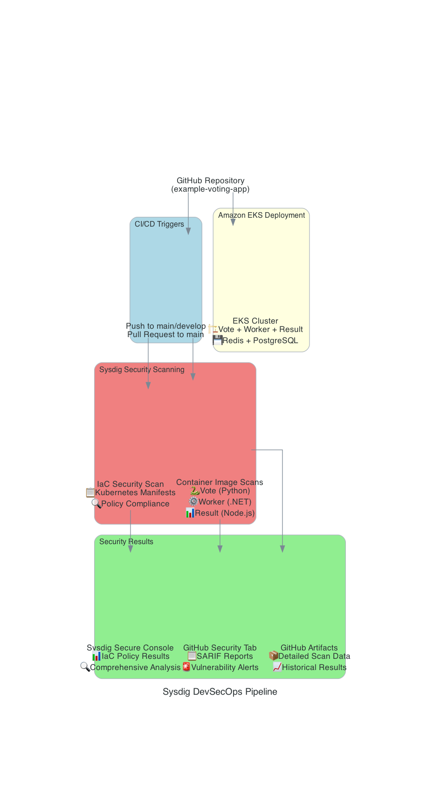

# 🗳️ Voting App with Sysdig Security Integration

**Sysdig v6 보안 통합이 적용된 마이크로서비스 아키텍처 데모 애플리케이션**

Amazon EKS 배포를 위한 완전한 DevSecOps 파이프라인이 구현된 투표 애플리케이션입니다.



## 🏗️ 아키텍처 개요

### 마이크로서비스 구성
- **Vote**: Python Flask 기반 투표 인터페이스
- **Worker**: .NET Core 기반 투표 처리 서비스  
- **Result**: Node.js 기반 실시간 결과 표시
- **Redis**: 인메모리 데이터 저장소 (투표 수집)
- **PostgreSQL**: 영구 데이터 저장소 (투표 결과)

### 보안 통합 시스템
- **컨테이너 이미지 스캔**: 각 마이크로서비스별 취약점 검사
- **IaC 보안 검증**: Kubernetes 매니페스트 보안 설정 검증
- **GitHub Security 연동**: SARIF 기반 취약점 시각화
- **Sysdig 통합**: 종합적인 보안 분석 및 정책 관리

## 🔐 보안 파이프라인

### 자동화된 보안 검사
매 커밋과 Pull Request마다 다음 보안 검사가 자동 실행됩니다:

| 검사 유형 | 대상 | 결과 확인 위치 | 목적 |
|-----------|------|----------------|------|
| **IaC 스캔** | `k8s-specifications/` | Sysdig Console | EKS 배포 보안 설정 검증 |
| **Vote 스캔** | Python Flask 이미지 | GitHub Security + Sysdig | Python 패키지 취약점 |
| **Worker 스캔** | .NET Core 이미지 | GitHub Security + Sysdig | .NET 런타임 취약점 |
| **Result 스캔** | Node.js 이미지 | GitHub Security + Sysdig | npm 패키지 취약점 |

### 보안 결과 확인
- **GitHub Security 탭**: 컨테이너 이미지 취약점 (SARIF 형식)
- **Sysdig Secure Console**: 종합 보안 분석 및 IaC 정책 검증
- **Pull Request**: 자동 보안 검사 결과 표시

## 🚀 EKS 배포 가이드

### 사전 요구사항
```bash
# AWS CLI 설정
aws configure

# kubectl 설치 및 EKS 클러스터 연결
aws eks update-kubeconfig --region <region> --name <cluster-name>

# 필요한 도구들
kubectl version --client
helm version
```

### 1단계: EKS 클러스터 배포
```bash
# Kubernetes 매니페스트 배포
kubectl apply -f k8s-specifications/

# 배포 상태 확인
kubectl get pods -o wide
kubectl get services
```

### 2단계: 서비스 접근
```bash
# Vote 서비스 (포트 31000)
kubectl port-forward service/vote 8080:80

# Result 서비스 (포트 31001)  
kubectl port-forward service/result 8081:80
```

### 3단계: 로드밸런서 설정 (선택사항)
```bash
# AWS Load Balancer Controller 설치
helm repo add eks https://aws.github.io/eks-charts
helm install aws-load-balancer-controller eks/aws-load-balancer-controller \
  -n kube-system \
  --set clusterName=<cluster-name>
```

## 🛡️ 보안 설정

### GitHub Secrets 구성
다음 시크릿을 GitHub 저장소에 설정해야 합니다:

```bash
SYSDIG_SECURE_API_TOKEN=<your-sysdig-api-token>
SYSDIG_SECURE_ENDPOINT=<your-sysdig-endpoint>
```

### 보안 기능 활성화
1. **자동 스캔**: 코드 push 시 자동 실행
2. **PR 검증**: Pull Request 생성 시 보안 검사
3. **취약점 알림**: GitHub Security 탭에서 실시간 모니터링

## 📊 보안 분석 결과

### 위험도 평가 (예상)
| 서비스 | 기술 스택 | 위험도 | 주요 관심사항 |
|--------|-----------|--------|---------------|
| **Result** | Node.js | 🔴 높음 | npm 패키지 취약점 다수 |
| **Vote** | Python | 🟡 중간 | Python 의존성 관리 필요 |
| **Worker** | .NET Core | 🟢 낮음 | 안정적인 런타임 환경 |

### EKS 보안 모범 사례 적용
- ✅ **보안 컨텍스트**: 비특권 사용자 실행
- ✅ **네트워크 정책**: 서비스 간 통신 제한
- ✅ **리소스 제한**: CPU/메모리 제한 설정
- ✅ **시크릿 관리**: Kubernetes Secrets 활용

## 🔍 모니터링 및 관찰성

### 실시간 모니터링
- **Sysdig Monitor**: 컨테이너 성능 및 보안 메트릭
- **Kubernetes Dashboard**: 클러스터 상태 모니터링
- **AWS CloudWatch**: EKS 클러스터 로그 및 메트릭

### 보안 이벤트 추적
- **취약점 트렌드**: 시간별 보안 상태 변화
- **정책 위반**: 실시간 보안 정책 위반 감지
- **컴플라이언스**: 보안 표준 준수 상태

## 📚 추가 문서

- **[Sysdig 통합 가이드 (한국어)](docs/sysdig-integration-guide-ko.md)**: 상세한 보안 통합 문서
- **[보안 설정](security/)**: 런타임 정책 및 컴플라이언스 설정
- **[EKS 배포 가이드](k8s-specifications/)**: Kubernetes 매니페스트 상세 설명

## 🔧 기술 스택 및 특징

### 핵심 기술
- **컨테이너 오케스트레이션**: Amazon EKS (Kubernetes)
- **마이크로서비스**: Python Flask, .NET Core, Node.js
- **데이터 저장소**: Redis (캐시), PostgreSQL (영구 저장)
- **보안 통합**: Sysdig v6 (취약점 스캔, 정책 검증)

### DevSecOps 구현
- **자동화된 보안 검사**: CI/CD 파이프라인 통합
- **다중 보안 계층**: 컨테이너 + 인프라 보안
- **실시간 모니터링**: 지속적인 보안 상태 추적
- **컴플라이언스**: 보안 표준 자동 검증

---

**🚀 이 프로젝트는 실제 프로덕션 환경에서 사용할 수 있는 보안 모범 사례를 구현한 데모 애플리케이션입니다.**

**📧 문의사항이나 개선 제안이 있으시면 언제든 연락주세요!**
