# 🛡️ Secure Voting App with DevSecOps Pipeline

A production-ready microservices voting application showcasing **comprehensive DevSecOps practices** with **Sysdig Security**, **ArgoCD GitOps**, and **automated security scanning** throughout the entire software delivery lifecycle.

## 🏗️ Architecture Overview

### Microservices Stack
- **🗳️ Vote**: Python Flask frontend for user voting
- **⚙️ Worker**: .NET Core background processor for vote processing  
- **📊 Result**: Node.js results display dashboard
- **🗄️ Database**: PostgreSQL for persistent storage + Redis for caching

### 🔒 Security-First Design
- **Container Security**: Hardened images with non-root users and read-only filesystems
- **Network Security**: Kubernetes Network Policies for micro-segmentation
- **Resource Security**: CPU/Memory limits and security contexts
- **Supply Chain Security**: Automated vulnerability scanning and SBOM generation

## 🚀 DevSecOps Pipeline Architecture

```mermaid
graph LR
    A[Developer Push] --> B[GitHub Actions]
    B --> C[Docker Build]
    C --> D[🛡️ Sysdig Security Scan]
    D --> E[Harbor Registry Push]
    E --> F[GitOps Manifest Update]
    F --> G[ArgoCD Sync]
    G --> H[Kubernetes Deployment]
    
    D --> I[SARIF Report]
    I --> J[GitHub Security Tab]
    
    D --> K[Policy Evaluation]
    K --> L[Compliance Check]
```



### 🔄 CI/CD Workflow Features

#### **Continuous Integration (CI)**
- **Multi-platform builds**: `linux/amd64` optimized containers
- **Parallel execution**: Independent service pipelines with intelligent path-based triggers
- **Artifact management**: Secure image storage in Harbor Registry with vulnerability metadata

#### **Security Integration (Sec)**
- **🔍 Vulnerability Scanning**: Sysdig Secure integration with medium+ severity detection
- **📋 Policy Evaluation**: Automated compliance checks against security benchmarks
- **📊 SBOM Generation**: Software Bill of Materials for supply chain transparency
- **🚨 Security Reporting**: SARIF integration with GitHub Security tab
- **🏗️ Infrastructure Security**: IaC scanning for Kubernetes manifests and ArgoCD configurations

#### **Continuous Deployment (CD)**
- **🔄 GitOps Automation**: Automatic manifest updates with conflict resolution
- **📦 ArgoCD Integration**: Declarative, auditable deployments with rollback capabilities
- **🎯 Progressive Delivery**: Service-specific deployment with dependency management

## 📁 Project Structure

```
📦 example-voting-app-private/
├── 🐳 Services/
│   ├── vote/                    # Python Flask voting interface
│   ├── worker/                  # .NET Core vote processor
│   └── result/                  # Node.js results dashboard
├── 🚀 GitOps Manifests/
│   └── manifests/
│       ├── base/                # Namespace & Network Policies
│       ├── vote/                # Vote service K8s resources
│       ├── worker/              # Worker service K8s resources
│       ├── result/              # Result service K8s resources
│       └── database/            # PostgreSQL & Redis resources
├── 🔄 ArgoCD Configuration/
│   └── argocd/
│       ├── applications/        # Individual service Applications
│       └── voting-app.yaml     # App-of-Apps main controller
├── 🛡️ CI/CD Pipelines/
│   └── .github/workflows/
│       ├── vote.yaml           # Vote service pipeline
│       ├── worker.yaml         # Worker service pipeline
│       ├── result.yaml         # Result service pipeline
│       └── iac.yaml            # Infrastructure security scanning
└── 📚 Documentation/
    ├── README.md               # This comprehensive guide
    └── ARGOCD_DEPLOYMENT.md    # GitOps deployment instructions
```

## 🛡️ Security Features

### **Container Security**
```yaml
securityContext:
  allowPrivilegeEscalation: false
  runAsNonRoot: true
  runAsUser: 1000
  capabilities:
    drop: [ALL]
  readOnlyRootFilesystem: true
```

### **Network Security**
- **Micro-segmentation**: Network policies restricting inter-service communication
- **Principle of Least Privilege**: Services can only access required dependencies
- **DNS Security**: Controlled DNS resolution within cluster boundaries

### **Resource Security**
```yaml
resources:
  requests:
    memory: "64Mi"
    cpu: "50m"
  limits:
    memory: "128Mi" 
    cpu: "100m"
```

## 🔧 Configuration & Secrets

### **Required Secrets**
```bash
# Harbor Registry Authentication
HARBOR_USERNAME=<your-harbor-username>
HARBOR_PASSWORD=<your-harbor-password>

# Sysdig Security Integration  
SYSDIG_SECURE_API_TOKEN=<your-sysdig-token>
SYSDIG_SECURE_ENDPOINT=https://app.us4.sysdig.com
```

### **Harbor Registry Configuration**
- **Registry**: `hw-harbor.bluesunnywings.com`
- **Project**: `sysdig-poc`
- **Image Naming**: `service:v2-{git-sha}`

## 🚀 Deployment Guide

### **Prerequisites**
- Kubernetes cluster with ArgoCD installed
- Harbor Registry access
- Sysdig Secure account and API token
- GitHub repository with required secrets configured

### **Quick Start**
```bash
# 1. Deploy complete application stack using App-of-Apps pattern
kubectl apply -f argocd/voting-app.yaml

# 2. Verify deployment status
kubectl get applications -n argocd

# 3. Access ArgoCD UI for monitoring
kubectl port-forward svc/argocd-server -n argocd 8080:443
```

### **Alternative: Individual Service Deployment**
```bash
# Deploy services individually for granular control
kubectl apply -f argocd/applications/base-app.yaml      # Namespace & policies first
kubectl apply -f argocd/applications/database-app.yaml # Database layer
kubectl apply -f argocd/applications/vote-app.yaml     # Application services
kubectl apply -f argocd/applications/worker-app.yaml
kubectl apply -f argocd/applications/result-app.yaml
```

## 🔄 GitOps Workflow

### **Automated Pipeline Flow**
1. **Code Change**: Developer pushes code to service directory
2. **CI Trigger**: GitHub Actions automatically triggered by path-based detection
3. **Security Scan**: Sysdig performs comprehensive vulnerability assessment
4. **Image Build**: Multi-stage Docker build with security hardening
5. **Registry Push**: Secure image storage in Harbor with metadata
6. **GitOps Update**: Automated manifest update with conflict resolution
7. **ArgoCD Sync**: Declarative deployment with health monitoring
8. **Security Reporting**: Results integrated into GitHub Security tab

### **Conflict Resolution**
The pipeline includes robust conflict resolution for concurrent updates:
- **Service Isolation**: Independent concurrency groups per service
- **Retry Logic**: 10-attempt retry with exponential backoff and jitter
- **Smart Rebase**: Reset-rebase-reapply pattern for reliable conflict resolution
- **Change Detection**: Intelligent detection of already-applied changes

## 📊 Monitoring & Security

### **Sysdig Security Dashboard**
- **Vulnerability Management**: Real-time container and host vulnerability assessment
- **Compliance Monitoring**: CIS, PCI-DSS, and custom policy compliance
- **Runtime Security**: Behavioral analysis and threat detection
- **Network Security**: Service mesh security and network policy validation

### **GitHub Security Integration**
- **Security Tab**: SARIF vulnerability reports with remediation guidance
- **Dependency Scanning**: Automated dependency vulnerability detection
- **Code Scanning**: Static analysis security testing (SAST)
- **Secret Scanning**: Prevention of credential exposure

### **ArgoCD Monitoring**
```bash
# Application health status
kubectl get applications -n argocd

# Detailed application information
kubectl describe application voting-app -n argocd

# Sync status and history
argocd app get voting-app
argocd app history voting-app
```

## 🔧 Troubleshooting

### **Common Issues & Solutions**

#### **Image Pull Failures**
```bash
# Verify Harbor registry secret
kubectl get secret harbor-registry-secret -n voting-app -o yaml

# Check image availability
docker pull hw-harbor.bluesunnywings.com/sysdig-poc/vote:v2-latest
```

#### **Network Policy Issues**
```bash
# Verify network policies
kubectl get networkpolicy -n voting-app
kubectl describe networkpolicy vote-network-policy -n voting-app

# Test connectivity
kubectl exec -it vote-pod -- nc -zv redis 6379
```

#### **ArgoCD Sync Failures**
```bash
# Check application logs
kubectl logs -n argocd -l app.kubernetes.io/name=argocd-application-controller

# Manual sync
argocd app sync voting-app --force
```

#### **Security Scan Failures**
- Verify Sysdig API token and endpoint configuration
- Check image accessibility from Sysdig scanner
- Review policy configuration for severity thresholds

## 🔄 Rollback Procedures

### **GitOps-based Rollback**
```bash
# Rollback via Git history
git revert <commit-hash>
git push origin main

# ArgoCD will automatically sync to previous state
```

### **ArgoCD Application Rollback**
```bash
# List application history
argocd app history voting-app

# Rollback to specific revision
argocd app rollback voting-app <revision-id>
```

### **Emergency Rollback**
```bash
# Quick rollback to previous image
kubectl set image deployment/vote vote=hw-harbor.bluesunnywings.com/sysdig-poc/vote:v2-previous -n voting-app
```

## 🎯 Best Practices

### **Security**
- ✅ Regular vulnerability scanning and patching
- ✅ Principle of least privilege for all components
- ✅ Network segmentation with policies
- ✅ Immutable infrastructure patterns
- ✅ Secrets management with rotation

### **Operations**
- ✅ Infrastructure as Code for all components
- ✅ Automated testing in CI/CD pipelines
- ✅ Comprehensive monitoring and alerting
- ✅ Disaster recovery procedures
- ✅ Regular security assessments

### **Development**
- ✅ Shift-left security practices
- ✅ Container image optimization
- ✅ Dependency management and updates
- ✅ Code quality and security scanning
- ✅ Documentation and knowledge sharing

## 📈 Metrics & KPIs

### **Security Metrics**
- **Vulnerability Detection Time**: Average time to identify vulnerabilities
- **Remediation Time**: Time from detection to fix deployment
- **Policy Compliance**: Percentage of compliant deployments
- **Security Scan Coverage**: Percentage of images scanned

### **Operational Metrics**
- **Deployment Frequency**: Number of successful deployments per day
- **Lead Time**: Time from commit to production
- **Mean Time to Recovery (MTTR)**: Average recovery time from incidents
- **Change Failure Rate**: Percentage of deployments causing issues

## 🤝 Contributing

1. **Fork** the repository
2. **Create** a feature branch (`git checkout -b feature/amazing-security-feature`)
3. **Commit** your changes (`git commit -m 'Add amazing security feature'`)
4. **Push** to the branch (`git push origin feature/amazing-security-feature`)
5. **Open** a Pull Request with security considerations documented

## 📚 Additional Resources

- [ArgoCD Documentation](https://argo-cd.readthedocs.io/)
- [Sysdig Secure Documentation](https://docs.sysdig.com/en/docs/sysdig-secure/)
- [Kubernetes Security Best Practices](https://kubernetes.io/docs/concepts/security/)
- [Harbor Registry Documentation](https://goharbor.io/docs/)
- [GitHub Actions Security](https://docs.github.com/en/actions/security-guides)

## 📄 License

This project is licensed under the MIT License - see the [LICENSE](LICENSE) file for details.

---

**🛡️ Built with Security in Mind | 🚀 Powered by GitOps | 📊 Monitored by Sysdig**
