# 🗳️ Voting App with Sysdig Security Integration

**Enterprise-grade microservices application with integrated DevSecOps pipeline**

A comprehensive voting application demonstrating modern cloud-native security practices with Sysdig v6 integration, designed for Amazon EKS deployment.

## 🔄 Security Pipeline Architecture

```mermaid
flowchart TD
    A[GitHub Repository<br/>example-voting-app-private] --> B{CI/CD Trigger}
    
    B --> C[Push to main/develop]
    B --> D[Pull Request to main]
    
    C --> E[Security Scanning Pipeline]
    D --> E
    
    E --> F[IaC Security Scan<br/>📋 Kubernetes Manifests]
    E --> G[Vote Service Scan<br/>🐍 Python Flask]
    E --> H[Worker Service Scan<br/>⚙️ .NET Core]
    E --> I[Result Service Scan<br/>📊 Node.js]
    
    F --> J[Sysdig Secure Console<br/>📊 Policy Compliance<br/>🔍 IaC Analysis]
    
    G --> K[GitHub Security Tab<br/>📋 SARIF Reports<br/>🚨 Vulnerability Alerts]
    H --> K
    I --> K
    
    G --> L[GitHub Artifacts<br/>📦 Detailed Scan Data<br/>📈 Historical Results]
    H --> L
    I --> L
    
    A --> M[Amazon EKS Deployment<br/>🏗️ Microservices<br/>💾 Data Layer]
    
    style A fill:#e1f5fe
    style E fill:#fff3e0
    style J fill:#f3e5f5
    style K fill:#e8f5e8
    style L fill:#e8f5e8
    style M fill:#fff8e1
```



## 🏗️ Application Architecture

### Microservices Components
- **Vote Service**: Python Flask web interface for casting votes
- **Worker Service**: .NET Core background processor for vote processing  
- **Result Service**: Node.js real-time results dashboard
- **Redis**: In-memory data store for vote queuing
- **PostgreSQL**: Persistent database for vote storage

### Security Integration Stack
- **Container Image Scanning**: Vulnerability assessment for each microservice
- **Infrastructure as Code (IaC) Validation**: Kubernetes manifest security verification
- **GitHub Security Integration**: SARIF-based vulnerability visualization
- **Sysdig Platform**: Comprehensive security analysis and policy management

## 🔐 DevSecOps Pipeline

### Automated Security Checks
Every commit and pull request triggers comprehensive security scanning:

| Scan Type | Target | Results Location | Purpose |
|-----------|--------|------------------|---------|
| **IaC Scan** | `k8s-specifications/` | Sysdig Console | EKS deployment security validation |
| **Vote Scan** | Python Flask image | GitHub Security + Sysdig | Python package vulnerabilities |
| **Worker Scan** | .NET Core image | GitHub Security + Sysdig | .NET runtime vulnerabilities |
| **Result Scan** | Node.js image | GitHub Security + Sysdig | npm package vulnerabilities |

### Security Results Dashboard
- **GitHub Security Tab**: Container image vulnerabilities (SARIF format)
- **Sysdig Secure Console**: Comprehensive security analysis and IaC policy validation
- **Pull Request Checks**: Automated security validation results

## 🚀 Quick Start Guide

### Prerequisites
```bash
# AWS CLI configuration
aws configure

# kubectl installation and EKS cluster connection
aws eks update-kubeconfig --region <region> --name <cluster-name>

# Required tools
kubectl version --client
helm version
```

### Deployment Steps

#### 1. Deploy to EKS Cluster
```bash
# Apply Kubernetes manifests
kubectl apply -f k8s-specifications/

# Verify deployment status
kubectl get pods -o wide
kubectl get services
```

#### 2. Access Services
```bash
# Vote service (port 31000)
kubectl port-forward service/vote 8080:80

# Result service (port 31001)  
kubectl port-forward service/result 8081:80
```

#### 3. Load Balancer Setup (Optional)
```bash
# Install AWS Load Balancer Controller
helm repo add eks https://aws.github.io/eks-charts
helm install aws-load-balancer-controller eks/aws-load-balancer-controller \
  -n kube-system \
  --set clusterName=<cluster-name>
```

## 🛡️ Security Configuration

### Required GitHub Secrets
Configure the following secrets in your GitHub repository:

```bash
SYSDIG_SECURE_API_TOKEN=<your-sysdig-api-token>
SYSDIG_SECURE_ENDPOINT=<your-sysdig-endpoint>
```

### Security Features
- **Automated Scanning**: Triggered on code push and PR creation
- **PR Security Validation**: Security checks integrated into pull request workflow
- **Real-time Monitoring**: Continuous vulnerability tracking via GitHub Security tab

## 📊 Security Analysis Overview

### Risk Assessment Matrix
| Service | Technology Stack | Risk Level | Key Concerns |
|---------|------------------|------------|--------------|
| **Result** | Node.js | 🔴 High | npm package vulnerabilities |
| **Vote** | Python Flask | 🟡 Medium | Python dependency management |
| **Worker** | .NET Core | 🟢 Low | Stable runtime environment |

### EKS Security Best Practices Implementation
- ✅ **Security Contexts**: Non-privileged user execution
- ✅ **Network Policies**: Inter-service communication restrictions
- ✅ **Resource Limits**: CPU/memory constraints configured
- ✅ **Secret Management**: Kubernetes Secrets utilization

## 🔍 Monitoring & Observability

### Real-time Monitoring
- **Sysdig Monitor**: Container performance and security metrics
- **Kubernetes Dashboard**: Cluster health monitoring
- **AWS CloudWatch**: EKS cluster logs and metrics

### Security Event Tracking
- **Vulnerability Trends**: Time-series security status analysis
- **Policy Violations**: Real-time security policy breach detection
- **Compliance Monitoring**: Security standard adherence tracking

## 📚 Documentation

- **[Security Configuration](security/)**: Runtime policies and compliance settings
- **[EKS Deployment Guide](k8s-specifications/)**: Detailed Kubernetes manifest documentation
- **[Project Summary](PROJECT-SUMMARY.md)**: Comprehensive project overview

## 🔧 Technology Stack

### Core Technologies
- **Container Orchestration**: Amazon EKS (Kubernetes)
- **Microservices**: Python Flask, .NET Core, Node.js
- **Data Layer**: Redis (cache), PostgreSQL (persistent storage)
- **Security Platform**: Sysdig v6 (vulnerability scanning, policy validation)

### DevSecOps Implementation
- **Automated Security Testing**: CI/CD pipeline integration
- **Multi-layer Security**: Container + infrastructure security
- **Continuous Monitoring**: Real-time security status tracking
- **Compliance Automation**: Automated security standard validation

## 🚦 Getting Started

1. **Clone Repository**: `git clone <repository-url>`
2. **Configure Secrets**: Set up Sysdig API credentials in GitHub
3. **Deploy to EKS**: Apply Kubernetes manifests
4. **Monitor Security**: Check GitHub Security tab and Sysdig Console
5. **Iterate Securely**: Use automated security checks for development

---

**🚀 This project demonstrates production-ready security practices for cloud-native applications.**

**📧 For questions or improvements, please open an issue or submit a pull request.**
