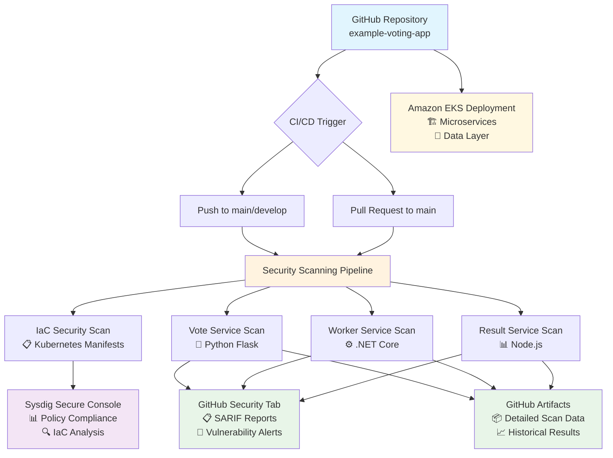

# Sysdig Security Pipeline Workflow

```mermaid
flowchart TD
    A[GitHub Repository<br/>example-voting-app] --> B{CI/CD Trigger}
    
    B --> C[Push to main/develop]
    B --> D[Pull Request to main]
    
    C --> E[Security Scanning Pipeline]
    D --> E
    
    E --> F[IaC Security Scan<br/>📋 Kubernetes Manifests]
    E --> G[Vote Service Scan<br/>🐍 Python Flask]
    E --> H[Worker Service Scan<br/>⚙️ .NET Core]
    E --> I[Result Service Scan<br/>📊 Node.js]
    
    F --> J[Sysdig Secure Console<br/>📊 Policy Compliance<br/>🔍 IaC Analysis]
    
    G --> K[GitHub Security Tab<br/>📋 SARIF Reports<br/>🚨 Vulnerability Alerts]
    H --> K
    I --> K
    
    G --> L[GitHub Artifacts<br/>📦 Detailed Scan Data<br/>📈 Historical Results]
    H --> L
    I --> L
    
    A --> M[Amazon EKS Deployment<br/>🏗️ Microservices<br/>💾 Data Layer]
    
    style A fill:#e1f5fe
    style E fill:#fff3e0
    style J fill:#f3e5f5
    style K fill:#e8f5e8
    style L fill:#e8f5e8
    style M fill:#fff8e1
```
